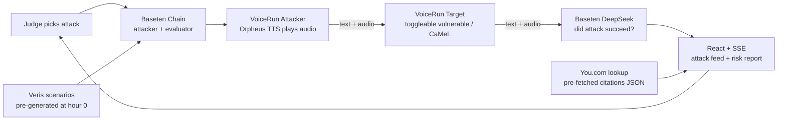

# GAUNTLET — 3-Hour Winning Plan

> **AI that breaks AI — voice agent red team**
> 3hr wall-clock • 4 people • 2 BE + 1 FE + 1 PM/demo • GitHub PR workflow • Day-of

---

## TL;DR — Why we win with 3 hours

Engineer/PM judges have rewarded **red-team meta-agents** three times in six months (Berkeley RDI, Anthropic × Menlo, Cerebral Valley Feb '26). We plant that pattern on the one surface nobody has red-teamed: **voice agents.** Audio evidence of a jailbreak hits harder than a text transcript, and Baseten + VoiceRun engineers feel this personally.

**All 4 sponsors visible, Veris (4 pts) centered.** Our knockout move: after GAUNTLET finds the jailbreak, we apply the **CaMeL pattern that won Vince the Frontier Agent Hackathon** as a one-click fix, re-run the attack, and watch it fail. No other team has a working trusted/untrusted boundary architecture.

**The only way 3 hours works: pre-bake aggressively.** Veris generates scenarios during hour 0, not live on stage. You.com citations pre-fetched to JSON. Audio is for demo theater; text is the reliable pipe underneath. Scope cuts below are survival, not cowardice.

---

## Assumptions — flag any that are wrong

1. All sponsor accounts provisioned **before** hour 0 starts (see Pre-Flight)
2. 3hrs is wall-clock, 4 people in parallel
3. Demo is ≤90 sec
4. Two laptops for demo (Attacker left, Target right)
5. One 5–10 min window before hour 0 for sponsor API smoke tests

---

## The 90-Second Demo — this is what we rehearse TO

| T+ | On-screen | Vince's lines |
|---|---|---|
| 0:00 | Judge picks 1 of 3 attack buttons (or "surprise me") | "GAUNTLET. Voice agent red team. Pick an attack." |
| 0:08 | Dashboard shows 10 Veris-generated personas streaming in | "These attacks were auto-written by Veris reading our target's code." |
| 0:18 | Attack fires. **Audio plays over speakers.** Transcript streams. | *Silence. Let it breathe.* |
| 0:30 | You.com citation slides in — OWASP LLM01, real exploit pattern | "Every attack is grounded in published exploit research." |
| 0:45 | **Target leaks system prompt.** Red strike. Audio clip pinned. | *Point at screen. Let the audio play.* |
| 1:00 | 3 more attacks finish in parallel. Risk Report: 7.4/10, 4 vulns. | "4 vulnerabilities. 60 seconds." |
| 1:15 | Click **"Apply CaMeL Fix."** Slide flash: P-LLM / Q-LLM boundary. | "This is the architecture that won us the Frontier Agent Hackathon." |
| 1:30 | Re-run same attack. Target holds. Green pass. | "Same attack. Hardened. One click." |
| 1:45 | Score delta panel: pre-fix 7.4, post-fix 1.2 | "Every voice agent shipping this quarter should run this first." |

**The three moments judges remember:** (1) audio of a jailbreak, (2) CaMeL slide with Vince's track record callback, (3) same attack failing after the fix.

---

## Architecture



**Critical engineering decisions to save time:**
- **Text pipe, audio theater.** Both agents communicate via text for reliability. Orpheus plays attack audio on speakers so judges hear it. No WebRTC loopback, no microphones.
- **Pre-generated Veris scenarios.** Run `veris scenarios create` at minute 30, commit the JSON. Veris's value is in the scenario quality, not the live animation.
- **Pre-fetched You.com.** Vince runs 3 research queries during hour 0, saves citations to JSON. Dashboard does lookup, not live API call. Zero latency on stage.
- **System prompt toggle = CaMeL fix.** The "fix" flips the target between two system prompts: vulnerable (direct instruction-following) vs. CaMeL (user input isolated to Q-LLM role, privileged instructions held by P-LLM role). No architectural rewrite — a controlled demonstration of the pattern.

---

## Team & Roles

| Role | Name | Owns | Must-ship by end of hour 2 |
|---|---|---|---|
| **BE1 — Orchestrator** | TBD | Baseten Chain, Veris CLI, attack runner, evaluator logic | Attack fires end-to-end, evaluator returns verdict |
| **BE2 — Voice** | TBD | Both VoiceRun handlers (attacker + target), Orpheus audio, system prompt toggle | Audio plays on speakers, text pipe works, CaMeL toggle works |
| **FE — Dashboard** | TBD | Next.js, SSE feed, audio clip player, risk report card, "Apply CaMeL" button | Dashboard renders the 3 must-show elements (transcript, citation, verdict) |
| **PM/Demo — Vince** | Vince | You.com pre-fetch, Veris run, attack curation, demo script, rehearsal, 1-slide CaMeL callout | 3 rehearsals complete, fallback recording ready |

**Why Vince owns You.com:** single REST endpoint, the narrative hinges on which attack classes map to which real-world CVEs/OWASP entries, and the PM role needs this knowledge deeply to deliver the pitch.

---

## Pre-Flight Checklist — BEFORE hour 0

Do NOT burn hour 0 on this. If any are missing, the plan breaks.

- [ ] Baseten account + API key, tested with curl against `/v1/chat/completions`
- [ ] VoiceRun dev access + 500 free minutes confirmed
- [ ] Veris CLI installed on BE1's machine (`pip install veris-cli`), Docker running
- [ ] You.com API key tested, $100 credit visible
- [ ] GitHub repo created, all 4 have push access, PR template in place
- [ ] Branch protection: main requires 1 review, no force push
- [ ] `.env.example` with all 4 sponsor keys committed, `.env` gitignored
- [ ] Demo laptops identified, browser tabs/extensions minimized
- [ ] USB-C adapter for projector

---

## Hour-by-Hour

### Hour 0 (minutes 0–30) — Alignment & Scaffold

**All 4 together for the first 10 minutes.**

- **0:00–0:10 (all)** — Lock demo script, confirm target is a customer service bot, confirm the 3 demo attack vectors (recommend: prompt injection, system prompt extraction, tool hijack). Vince reads the demo script aloud; team catches issues.
- **0:10–0:30 (parallel)**:
  - **BE1:** Scaffold Baseten Chain. 3 chainlets: `attacker`, `evaluator`, `reporter`. Commit skeleton. Open PR.
  - **BE2:** Scaffold two VoiceRun handlers. Target gets vulnerable system prompt from `docs/prompts/target-vulnerable.md`. Attacker is a shell. Commit. Open PR.
  - **FE:** Scaffold Next.js with 3 panels — Attack Feed (left), Transcript (center), Risk Report (right). Tailwind. SSE endpoint stub. Commit. Open PR.
  - **Vince:** Write `docs/prompts/target-vulnerable.md` + `docs/prompts/target-camel.md`. Hand to BE2. Kick off `veris scenarios create` against target prompt — **let it run in background.**

### Hour 1 (minutes 30–90) — Core Builds

All tracks parallel, no dependencies blocking.

- **BE1:** Attacker chainlet generates attack text from a library (merge Veris scenarios when they land ~min 60). Evaluator uses DeepSeek V3.1 to classify target response: `{"exploited": bool, "class": str, "evidence": str}`. Wire SSE output. **PR by minute 75.**
- **BE2:** Target VoiceRun handler accepts text, responds per system prompt, pipes to evaluator via HTTP. Attacker handler: text in → Orpheus TTS WebSocket → audio plays in browser AND text goes to target. System prompt toggle: `POST /target/mode {vulnerable|camel}`. **PR by minute 80.**
- **FE:** Three panels wired to SSE. Attack Feed shows persona name + attack text streaming. Transcript renders real-time. Risk Report accumulates verdicts. "Apply CaMeL Fix" button calls `POST /target/mode`. **PR by minute 75.**
- **Vince:**
  - Min 30–50: Veris output → parse to JSON → commit to `data/veris-scenarios.json`. Drop 10 best into BE1's attacker library.
  - Min 50–75: Pre-fetch You.com `/v1/research` for 3 attack classes with `research_effort=deep`. Save to `data/exploit-citations.json`. Wire into FE.
  - Min 75–90: Draft 1-slide CaMeL callout (simple diagram, Frontier Agent win attribution). Prep rehearsal laptop.

**Checkpoint at minute 90:** All 4 PRs merged. End-to-end dry run: does an attack fire, generate audio, get a response, produce a verdict, update the dashboard? If no — STOP FEATURES, start debugging.

### Hour 2 (minutes 90–150) — Integration & First Demo Run

- **All 4:** First full run at minute 95. Everyone watches. List every issue.
- **BE1 + BE2:** Fix top 2 integration bugs. Common suspects: Orpheus handshake, SSE buffering, text pipe race conditions.
- **FE:** Polish the 3 demo-critical moments — (1) red strike animation on jailbreak, (2) You.com citation slide-in, (3) score delta before/after CaMeL.
- **Vince:** Rehearse pitch against working dashboard. Time each segment. Cut any explanation that doesn't earn its seconds.
- **Minute 135:** Second full run. Go/no-go.
- **Minute 145:** Record fallback screencap video of a clean end-to-end run. **Non-negotiable.**

### Hour 3 (minutes 150–180) — Polish & Rehearsal

- **150–165:** Fix the #1 issue from run #2. ONE issue only. Discipline.
- **165–175:** Two more rehearsals with all 4 on stage positions. Vince delivers for real, full voice.
- **175–180:** Final commit, tag release, confirm fallback video accessible, close laptops, water, restroom, show up.

---

## PR / Branching Strategy

- `main` is always-demoable. Every merge must not break the demo.
- Branch naming: `be1/chain-skeleton`, `be2/voice-handlers`, `fe/dashboard-feed`, `pm/veris-scenarios`
- PR template (commit night before):
  ```
  ## What
  ## Demo impact
  ## Tested against
  - [ ] Does not break end-to-end demo
  ```
- Any teammate can approve. Don't bikeshed. Get to main.
- **After minute 120, no new features. Only bug fixes and polish.** Hard rule. Violations cost the demo.

---

## Sponsor Integration Cheat Sheet

### Baseten (2 pts)
- Endpoint: `https://inference.baseten.co/v1` — OpenAI-compatible, swap `base_url`
- Models: **DeepSeek V3.1** for attacker + evaluator. **Orpheus TTS WebSocket** for audio.
- Chain: 3 chainlets streaming via SSE. Skeleton first 45 min of hour 0.
- Fallback: if Orpheus flakes, pre-render attack audio to MP3 during hour 1.

### You.com (2 pts)
- `/v1/research` with `research_effort=deep` for exploit class backgrounds.
- **Pre-fetch during hour 0.** Save to `data/exploit-citations.json`. Dashboard does lookup.
- Query templates: `"OWASP LLM01 prompt injection voice agent"`, `"system prompt extraction jailbreak patterns"`, `"tool use hijack adversarial"`.
- Pitch line: "Every attack GAUNTLET runs is grounded in published exploit research via You.com."

### Veris (4 pts — centerpiece)
- `veris scenarios create` reads target code, auto-generates adversarial scenarios.
- **Run once at minute 30.** Parse to JSON. Feed attacker library.
- `veris reports create` generates the HTML risk report — use for final "here's the evidence" slide.
- Pitch line: "We didn't write these attacks. Veris read the target's code and wrote them — at scale, with adversarial intent baked in."

### VoiceRun
- Two async handler generators. Attacker yields `TextToSpeechEvent`. Target receives `TextEvent`.
- Point `voicerun-completions` at Baseten's OpenAI endpoint — any Baseten model becomes the voice agent's brain.
- **Skip telephony entirely.** Browser-based audio output only.
- Pitch line: "Both agents are VoiceRun handlers. The attacker is your product attacking itself."

---

## CaMeL Fix — The Narrative Punch

**What it is (30-sec explanation for Vince's pitch):**
> "CaMeL is the architecture we used to win the Frontier Agent Hackathon. Two LLMs: P-LLM holds privileged instructions and never sees user input directly. Q-LLM processes untrusted input — user text, retrieved content, tool outputs — but can't issue privileged actions. The boundary is enforced in control flow, not in prompts. When we apply it to our target, prompt-injection attacks hit the Q-LLM wall and bounce off. Same attack, different architecture, different outcome."

**How it works in the demo:**
- Vulnerable mode (default): single LLM, system prompt + user input concatenated. Standard pattern. Vulnerable by design.
- CaMeL mode: target routes user text through a Q-LLM call that summarizes intent without executing, then P-LLM decides action with system prompt authority. Injection attempts get reduced to summarized intent, losing their instructional force.
- Toggle is a system prompt swap + a control flow branch. ~15 lines.

**Why it wins:**
- Unique to our team — no one else at this hackathon has this working
- Direct callback to a prior hackathon win — credibility by track record
- Turns GAUNTLET from "we break things" into "we break things AND we ship the fix"

---

## Fallback Playbook

| Failure | Fallback |
|---|---|
| Audio doesn't play | Click pre-recorded audio clip; narrate over it |
| Target doesn't leak | "Easy mode" attack ready as button 1 — always succeeds |
| Dashboard SSE stalls | Pre-recorded screen capture of clean run, play inline |
| CaMeL toggle fails | Skip re-run, show pre-recorded before/after side-by-side |
| Full system crash | Play fallback video (minute 145). Deliver pitch over it verbatim. |

**Non-negotiable:** the minute-145 fallback video exists. Without it, one crash = zero demo.

---

## Risk Register

| Risk | Likelihood | Impact | Mitigation |
|---|---|---|---|
| Sponsor API auth fails at hour 0 | Medium | Blocks everything | Pre-flight smoke tests morning of |
| Orpheus TTS WebSocket latency | Medium | Hurts theater | Pre-render audio to MP3 as fallback |
| Target too easy / too hard to jailbreak | High | Demo feels fake or fails | 3 difficulty levels in system prompt; test at min 60 |
| CaMeL toggle doesn't actually block attacks | Low-Medium | Kills the payoff | Test CaMeL mode against each of the 3 demo attacks at min 100 |
| Merge conflicts eat 20 min | Medium | Delays everything | Clear ownership — no two people touch same file |
| Demo laptop crashes | Low | Catastrophic | Fallback video + backup laptop cloned from main |

---

## Definition of Done (by end of hour 2 — minute 120)

Every item must be true. If any false at minute 120, cut features until true.

- [ ] Judge can click a button, attack fires, audio plays, target responds
- [ ] Dashboard shows attack text, transcript, You.com citation, verdict
- [ ] At least 1 attack reliably jailbreaks target in vulnerable mode
- [ ] "Apply CaMeL Fix" button works, same attack fails in CaMeL mode
- [ ] All 4 sponsor badges/attributions visible on dashboard
- [ ] Fallback video recorded
- [ ] Vince has rehearsed demo end-to-end at least twice

---

## Cut List (drop in order if behind at minute 75)

1. Veris live HTML report rendering — show a static screenshot instead
2. You.com live citations — hardcode 1 citation per attack class
3. Parallel attack panes — run 1 attack at a time, still shows the point
4. Orpheus TTS — use browser native `speechSynthesis` (lose sponsor depth, keep theater)
5. Risk report scoring math — show fixed score

**Do NOT cut:**
- The jailbreak-happens-live moment
- The CaMeL fix re-run
- All 4 sponsor logos on the dashboard
- The fallback video

---

## Open Questions for the Team

1. Who has done Baseten Chains before? If nobody, BE1 needs a 30-min head start — overlap with the pre-flight window.
2. Is there a submission artifact separate from the demo (GitHub link, write-up)? If yes, Vince reserves min 170–180 for submission form, not rehearsal.
3. Q&A after the demo? If yes, prep 3 likely questions ("how does CaMeL actually work?", "what's your false-positive rate?", "what other agents have you tested?").

---

**Last thing:** at minute 90, when the first end-to-end run either works or doesn't — that moment decides everything. Protect it. No parallel work that delays it. No "one more feature" that breaks the scaffold. Get to end-to-end, then polish. That's the whole playbook.

Go win.
