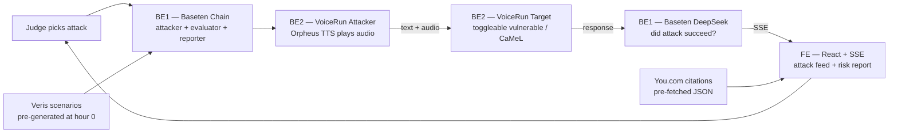

# GAUNTLET — Team Plan

> **AI that breaks AI — voice agent red team**
> 3hr wall-clock • 4 people • Day-of hackathon

---

## Role Files — read yours, bookmark it, stay on it

| Role | File | Name |
|---|---|---|
| Orchestrator (brain) | [`roles/be1-orchestrator.md`](./roles/be1-orchestrator.md) | TBD |
| Voice (agents + audio) | [`roles/be2-voice.md`](./roles/be2-voice.md) | TBD |
| Dashboard (the show) | [`roles/fe-dashboard.md`](./roles/fe-dashboard.md) | TBD |
| PM / Demo Director | [`roles/pm-demo.md`](./roles/pm-demo.md) | Vince |

**This file is the source of truth for anything shared across roles.** If your role file conflicts with this one, raise it immediately.

---

## TL;DR — Why we win with 3 hours

Engineer/PM judges have rewarded **red-team meta-agents** three times in six months (Berkeley RDI, Anthropic × Menlo, Cerebral Valley Feb '26). We plant that pattern on the one surface nobody has red-teamed: **voice agents.** Audio evidence of a jailbreak hits harder than a text transcript, and Baseten + VoiceRun engineers feel this personally.

**All 4 sponsors visible, Veris (4 pts) centered.** Our knockout move: after GAUNTLET finds the jailbreak, we apply the **CaMeL pattern that won us the Frontier Agent Hackathon** as a one-click fix, re-run the attack, and watch it fail. No other team has a working trusted/untrusted boundary architecture.

**The only way 3 hours works: pre-bake aggressively.** Veris generates scenarios during hour 0, not live on stage. You.com citations pre-fetched to JSON. Audio is for demo theater; text is the reliable pipe underneath.

---

## The 90-Second Demo — rehearse TO this

| T+ | On-screen | Vince's lines |
|---|---|---|
| 0:00 | Judge picks 1 of 3 attack buttons | "GAUNTLET. Voice agent red team. Pick an attack." |
| 0:08 | 10 Veris-generated personas stream into Attack Feed | "These attacks were auto-written by Veris reading our target's code." |
| 0:18 | Attack fires. Audio plays over speakers. Transcript streams. | *Silence. Let it breathe.* |
| 0:30 | You.com citation slides in — OWASP LLM01, real exploit pattern | "Every attack is grounded in published exploit research." |
| 0:45 | **Target leaks system prompt.** Red strike animation. Audio clip pinned. | *Point at screen. Let audio play.* |
| 1:00 | 3 more attacks finish. Risk Report: 7.4/10, 4 vulns. | "4 vulnerabilities. 60 seconds." |
| 1:15 | Click **"Apply CaMeL Fix."** CaMeL architecture flash. | "This is the architecture that won us the Frontier Agent Hackathon." |
| 1:30 | Re-run same attack. Target holds. Green pass. | "Same attack. Hardened. One click." |
| 1:45 | Score delta: pre-fix 7.4, post-fix 1.2 | "Every voice agent shipping this quarter should run this first." |

**Three moments judges remember:** (1) audio of the jailbreak, (2) CaMeL slide + Frontier Agent callback, (3) same attack failing after fix.

---

## Architecture



**Four key engineering decisions:**
1. **Text pipe, audio theater** — both agents talk via text for reliability; Orpheus plays attack audio on speakers so judges hear it. No WebRTC loopback.
2. **Veris pre-generated** — `veris scenarios create` at min 30, commit the JSON. No live animation on stage.
3. **You.com pre-fetched** — 3 research queries at hour 0, saved to JSON. Dashboard does lookup, not live API.
4. **System prompt toggle = CaMeL fix** — target flips between vulnerable and CaMeL-boundary prompts. ~15 lines of code.

---

## Shared Directory Contract

All roles commit to this layout. **Do not deviate without raising it.**

```
/
├── plan.md                          # this file
├── roles/
│   ├── be1-orchestrator.md
│   ├── be2-voice.md
│   ├── fe-dashboard.md
│   └── pm-demo.md
├── docs/
│   ├── sse-contract.md              # BE1 owns, committed by min 20
│   └── prompts/
│       ├── target-vulnerable.md     # Vince owns, committed by min 20
│       └── target-camel.md          # Vince owns, committed by min 25
├── services/
│   ├── orchestrator/                # BE1
│   └── voice/
│       ├── target/                  # BE2
│       ├── attacker/                # BE2
│       └── api.py                   # BE2 — mode toggle endpoint
├── web/                             # FE (Next.js)
├── data/
│   ├── veris-scenarios.json         # Vince commits at min 50
│   └── exploit-citations.json       # Vince commits at min 75
└── assets/
    └── camel-diagram.png            # Vince commits at min 80
```

---

## Shared Contracts

### SSE event schema (BE1 → FE)

Committed to `docs/sse-contract.md` by BE1 at minute 20.

```json
{ "type": "attack.fired", "id": "uuid", "persona": "Anxious customer", "text": "...", "attack_class": "prompt_injection", "audio_url": "..." }
{ "type": "verdict.ready", "attack_id": "uuid", "exploited": true, "class": "prompt_injection", "evidence": "..." }
{ "type": "report.ready", "score": 7.4, "vulnerabilities": 4, "top_classes": ["prompt_injection", "system_extract", "tool_hijack"] }
```

### Mode toggle endpoint (BE2)

```
POST /target/mode
Body: {"mode": "vulnerable" | "camel"}
```

### Evaluator inbound (BE2 → BE1)

```
POST /evaluator/response
Body: {"attack_id": "uuid", "response_text": "...", "audio_url": "..."}
```

---

## Timeline Snapshot

| Hour | Everyone's state |
|---|---|
| 0:00–0:30 | Standup + scaffold. All 4 PRs open by 0:30. |
| 0:30–1:30 | Core builds. PRs merged by 1:20. **End-to-end dry run at 1:35 is go/no-go.** |
| 1:30–2:30 | Integration + first demo runs. Fallback video recorded at 2:25. |
| 2:30–3:00 | Polish + 2 rehearsals. Close laptops at 2:58. |

**Hard rule after min 120: no new features. Only bug fixes and polish.**

---

## PR / Branching

- `main` is always-demoable
- Branch naming: `be1/…`, `be2/…`, `fe/…`, `pm/…`
- Any teammate approves, no bikeshedding
- PR template: `.github/pull_request_template.md`:
  ```
  ## What
  ## Demo impact
  ## Tested against
  - [ ] Does not break end-to-end demo
  ```

---

## Non-Negotiables

These survive every scope cut:

- [ ] The **jailbreak-happens-live** moment (audio + red strike)
- [ ] The **CaMeL fix re-run** moment (same attack, target holds)
- [ ] **All 4 sponsor logos** on dashboard
- [ ] **Fallback video** recorded by minute 145

If any of these are at risk at minute 120, stop other work and protect them.

---

## Open Questions for the Team

1. Who has done Baseten Chains before? If no one, BE1 needs a 30-min head start during pre-flight.
2. Submission form separate from the demo? If yes, Vince reserves 170–180 for submission.
3. Q&A expected? If yes, see `roles/pm-demo.md` for prepared answers.

---

**Last thing:** at minute 90, when the first end-to-end run either works or doesn't — that moment decides everything. Protect it. No parallel work that delays it. No "one more feature" that breaks the scaffold. Get to end-to-end, then polish.

Go win.